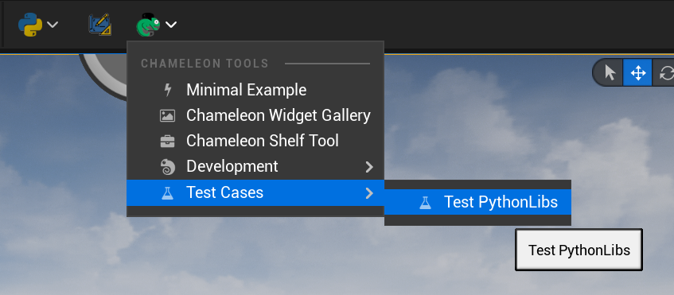

This is a repository of test cases in which the following will be included:

- [TAPython extended python editor APIs](https://www.tacolor.xyz/pages/ExtendedEditorAPI.html) (100% covered)

- [ChameleonDataAPI](https://www.tacolor.xyz/pages/ChameleonDataAPI.html) (WIP)

Recording video [here.](https://youtu.be/h5x0sb4IdR0)

These test cases are not only helpful to validate the APIs, but are also good examples for developers who want to become familiar with TAPython

## Require

### [TAPython v 1.0.9](https://github.com/cgerchenhp/UE_TAPython_Plugin_Release/releases/tag/v1.0.9-ue5.0.3)

### Unreal Engine Default StarterContent

### [easyocr](https://pypi.org/project/easyocr/) (optional 3rd package)

## Steps

1. Copy ./Content/_AssetsForTAPythonTestCase to Your_project's Content folder

2. Merge ./TA/TAPython to Your_project/TA/TAPython

   UI json: TA/TAPython/Python/ChameleonTestCases/TestPythonAPIs.json

3. The menu item on main bar: Test Cases - Test PythonLibs

## Asset List

Asset List in directory _AssetsForTAPythonTestCase

    Content\_AssetsForTAPythonTestCase\BP_A.uasset
    Content\_AssetsForTAPythonTestCase\BP_B.uasset
    Content\_AssetsForTAPythonTestCase\BP_C.uasset
    Content\_AssetsForTAPythonTestCase\GrassType\AGrassType.uasset
    Content\_AssetsForTAPythonTestCase\GrassType\Materials\M_Landscape_Grass.uasset
    Content\_AssetsForTAPythonTestCase\GrassType\Materials\M_Tree.uasset
    Content\_AssetsForTAPythonTestCase\Maps\NewMap.umap
    Content\_AssetsForTAPythonTestCase\Maps\OpenWorld\Sub_x00_y00.umap
    Content\_AssetsForTAPythonTestCase\Maps\OpenWorld\Sub_x00_y01.umap
    Content\_AssetsForTAPythonTestCase\Maps\OpenWorld\Sub_x01_y00.umap
    Content\_AssetsForTAPythonTestCase\Maps\OpenWorld\Sub_x01_y01.umap
    Content\_AssetsForTAPythonTestCase\Meshes\SM_QuarterCylinder.uasset